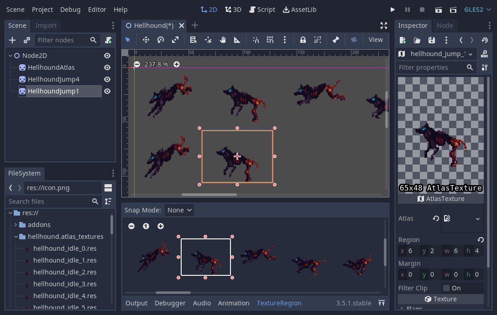

# Godot GDX Texture Packer Atlas Importer

GDX Texture Packer atlas importer for the [Godot Game Engine](https://godotengine.org/).

## Installation

[Download](https://github.com/Rubonnek/godot-gdx-texture-packer-importer/archive/refs/heads/main.zip) or clone this repository and copy the contents of the
`addons` folder to your own project's `addons` folder.

Then enable the plugin on the Project Settings.

## Usage

Pack the individual sprites using the [GDX Texture Packer GUI](https://github.com/crashinvaders/gdx-texture-packer-gui) and copy or move the exported spritesheet(s) (`.png`) along with the associated atlas information file (`.atlas`) to the same folder within your Godot project.

This plugin will generate a `<atlas_filename>.atlas_textures` folder within which you'll find the each `AtlasTexture` associated with the spritesheet(s), as well as a `<atlas_filename>.nine_patch_rects` folder within which you'll find the each `NinePatchRect` node associated with the spritesheet(s).

*Art taken from [Gothicvania Patreon's Collection](https://itch.io/queue/c/313331/gothicvania?game_id=255239) by [Ansimuz](https://linktr.ee/ansimuz)*

## Motivation

There are several benefits for using [GDX Texture Packer GUI](https://github.com/crashinvaders/gdx-texture-packer-gui) as an external texture packer:

1. Packing textures will no longer require you to restart Godot -- all that is needed is for the GDX atlas to be reimported.
2. [GDX Texture Packer GUI](https://github.com/crashinvaders/gdx-texture-packer-gui) itself provides an interface in which you can manage all your texture atlases separately which is great for bigger projects.
3. And packing your textures will increase performance since by doing so Godot will be able to minimize the number of screen draw calls which in turn could increase your frames per second depending on your workload.

## License

[MIT License](LICENSE). Copyright (c) 2021-present Wilson E. Alvarez.
